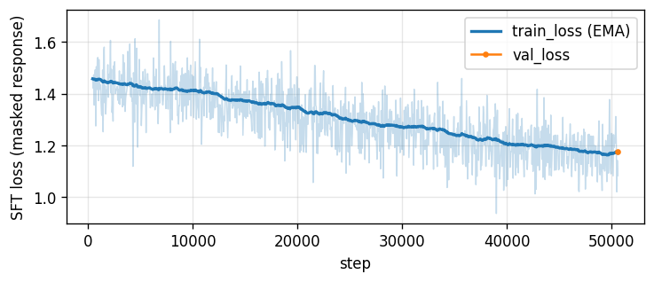
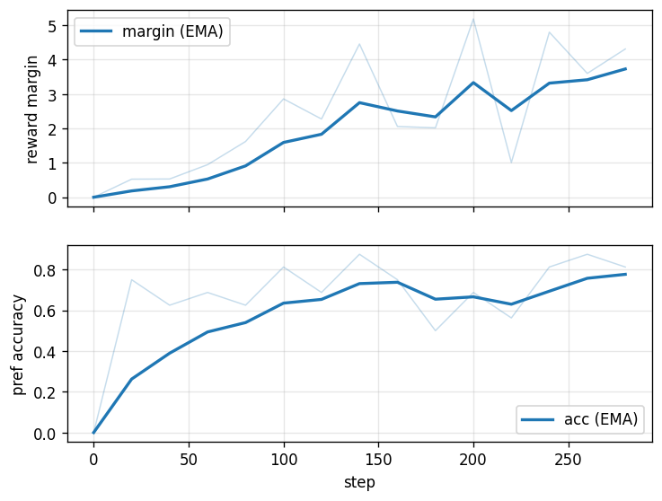
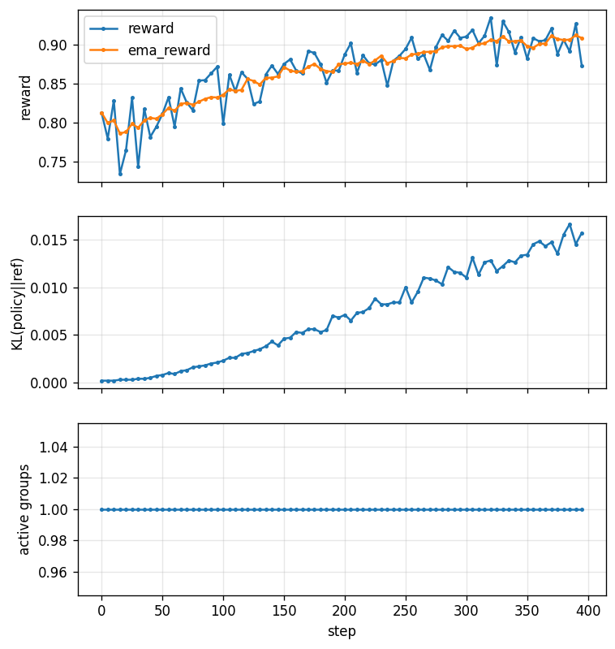
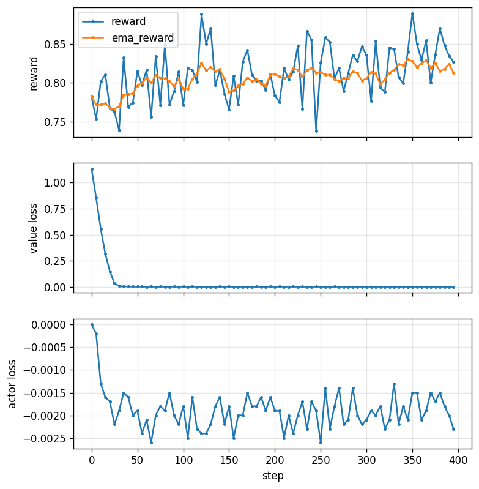

# pytorch-nanogpt
Pytorch implementation of a decoder-only GPT.

Trains a ~14M-parameter small language model end-to-end on the [TinyStories](https://huggingface.co/datasets/roneneldan/TinyStories) dataset, then explores the full modern post-training stack on [TinyStories Instruct](https://huggingface.co/datasets/roneneldan/TinyStoriesInstruct) with SFT (supervised fine-tuning) → DPO (direct policy optimization) → GRPO (group relative policy optimization) / PPO (proximal policy optimization).

--- 

## Results

After post-training, we evalute all the trained models with the SFT model as the baseline. For this we use 4 metrics:

1. **pass-rate** - the verifiable reward we chose. It's the fraction of words which the model is instructed to use in story generation that it actually uses.
2. **distinct-2** - distinct 2-grams / total 2-grams, a diversity proxy that catches repetitive, looping prose and tries to prevent reward hacking.
3. **win-rate** - the fraction of held-out prompts on which the stage's mean reward (over k=4 completions) beats SFT's.
4. **KL/tok** - per-token KL (Kullback–Leibler) divergence from the frozen SFT reference. It measures how far post-training has pulled the model from its starting distribution. A large KL is a diagnostic of over-optimization.

| stage | pass-rate | distinct-2 | win-rate vs SFT | KL/tok |
|---|---|---|---|---|
| Base | 0.177 | **0.971** | 0.000 (≥ SFT on 0.004) | 1.822 |
| SFT | 0.826 | 0.905 | — (baseline) | — |
| **DPO** | **0.967** | **0.930** | **0.736** (≥ SFT on 0.970) | 0.028 |
| GRPO | 0.950 | 0.920 | 0.694 (≥ SFT on 0.948) | 0.011 |
| PPO | 0.867 | 0.907 | 0.492 (≥ SFT on 0.754) | 0.002 |

For winrate, `≥ SFT` means that the model did at least as well as the SFT baseline i.e. the winrate including ties.

---

The main finding is that SFT training on the base model gives most of the improvement in capability; improving pass-rate from 0.18 to 0.83. The further post-training we performed gives further lift on top of that, but isn't as important as our SFT baseline.
- The **base** model: It's the most diverse (distinct-2 0.971) because its been training solely on next token generation so it ignores the task itself. We only optimize from here so a high diversity is exactly what we want.
- **SFT**: The most important functionality step and our baseline for post-training.
- **DPO**: Gave the best results with the highest pass-rate (0.967) and diversity (0.930), at a tiny KL (0.028). It's also the cheapest and simplest method.
- **GRPO**: A close second which achieves numbers near that of DPO for about a third of the KL (0.011).
- **PPO**: The heaviest method which performed much worse than the simpler methods (≥ SFT on 0.754) and with very little movement (KL 0.002).


Even though eyeballing some sentences we might choose to prefer some GRPO results over DPO, on other examples the opposite is also true and the metrics do a decent job of gauging the overall result quality. 

<details>
<summary><b>Words: escape, war, tall</b> - we need the SFT to follow the task itself.</summary>

> **Base** (r=0.00): army, army, army, army, army, army, army, army, army, army, army, army, army, army, army... *(collapses into a single repeated token)*
> **SFT** (r=1.00): Tom and Lily were playing in the forest. They saw a big, tall tree house... "It's a war!" Tom said. "We need to escape!" ...They were safe. They said "Thank you, Ben. You are a good friend."
> **DPO** (r=1.00): Once upon a time, there was a tall man named Tom... He went to the window and saw a big war... Lily said, "I want to escape from the scary house and find a place to live." ...They all lived together and had fun in the forest.
> **GRPO** (r=1.00): Once upon a time, there was a tall man named Tom... Tom saw a big war with many people. They were all scared and wanted to escape... They met a nice man named Ben... They stayed with Ben and had a fun day.
> **PPO** (r=1.00): Tom and Lily are friends... "We can escape from the house." ...It is very tall... "I am Ben. He is a war. He is a big war. He is mean. He is mean. He is mean..." *(pass-rate hit, but the tail loops)*

</details>

<details>
<summary><b>Words: meet, waffle, new</b> — DPO and GRPO make more sense contextually.</summary>

> **Base** (r=0.33): Words, new friends. *(ignores the task)*
> **SFT** (r=0.67): Once upon a time, there was a little girl named Lily. She got a new waffle for breakfast... She saw a new friend named Timmy... "Yes, I met a new friend named Timmy."
> **DPO** (r=1.00): ...She had a new waffle for breakfast... Lily decided to go outside and meet her new friend, Timmy... "Hi Timmy, do you want to meet me?" ...happy that she had met her new friend.
> **GRPO** (r=1.00): ...She had a new waffle for breakfast... She saw a new friend in the park. Her new friend was a little boy named Max... Lily was happy to meet Max and they became good friends.
> **PPO** (r=1.00): ...She loved waffles more than anything in the world... While playing, she saw a new friend. It was a big, fluffy dog... Lily was so happy to meet the new friend.
</details>

<br>


Finally, the main takeaways from this implementation exercise are:
- Reward hacking will generally find the gaps in any verifiable reward. It's a classic measurement problem: we need to be sure that what we're measuring actually represents the outcome we want.
- Similarly, for text-based problems it's important to consider multiple independent metrics. Pure validation loss on DPO training improved when training more than 1 epoch, but the validation perplexity increased from 2.9% to 42%. KL divergence alone didn't catch this.

---

## Getting Started

1. For GPU, go to the [pytorch](https://pytorch.org/get-started/locally/) website and select the local installs to get the bash command.

2. To use this repo, [install uv](https://docs.astral.sh/uv/getting-started/installation/). We use the [pytorch index](https://docs.astral.sh/uv/guides/integration/pytorch/#using-a-pytorch-index) for CUDA 12.6 [in this project](pyproject.toml).

3. Now install dependencies.

```bash
uv sync
```

4. The pipeline is driven from [src/main.py](src/main.py) which import each of the main functions which can also be run directly thanks to [hatchling](pyproject.toml). We can uncomment one stage at a time and run it as a module. 

```bash
uv run python -m src.main
```

5. The config [src/config.py](src/config.py) determines most of the runtime options. It's important to determine `context_length` and `vocab_size` early as its best for it to be fixed end-to-end.

6. Each training run saves the best checkpoint (by validation loss) under `checkpoints/<stage>/<timestamp>/` and SFT checkpoints are required to run DPO/GRPO/PPO.

7. The implementation for speculative-decoding is checked with [tests](tests/speculative_test.py).

```bash
uv run pytest
```

---

## Development

We split the development into 2 main parts - pretraining and post-training. 

1. Pretraining implements a decoder-only GPT as its continuation vs sequence-to-sequence generation.
2. We then explore the post-training stack
(SFT → DPO → GRPO/PPO).

---

## Part I - Pretraining

### 1. Data download
First we download the [TinyStories](https://huggingface.co/datasets/roneneldan/TinyStories) dataset using [data.py](src/data/data.py). This outputs `TinyStoriesV2-GPT4-train.txt` and `TinyStoriesV2-GPT4-valid.txt` with `<|endoftext|>` separators and automatic downloading/cache handling.

We follow much of Karpathy's [minGPT/nanoGPT](https://github.com/karpathy/mingpt) here.

### 2. Tokenizer
Next we train a SentencePiece BPE (byte pair encoding) [tokenizer](src/models/tokenizer.py) on the raw train text. We choose a vocab size of 8000 and `<|endoftext|>` doubles as both BOS and EOS tokens.

We made the decision to increase `max_sentence_length` to 8192 so that all full stories are used, and sample 2M stories from the full 14.6M. Since the corpus is small and repetitive, this is both sufficient and more efficient to train the model, outputting `spm.model` and `spm.vocab`.
 
### 3. Preprocess / pack 

Now we tokenize all the stories once and save the result. Then, by writing a [flat uint16 memmap](src/data/pack.py) (memory-mapped file) for both the train and validation splits (8k vocab fits in uint16), we can sample random slices at train time while the data stays on disk - keeping memory use low.

While we have the whole corpus tokenized, we also measure the per-story token-length distribution to determine the context length.

| split | tokens | stories | file |
|---|---|---|---|
| train | 530,386,257 | 2,717,700 | `data/packed/train.bin` |
| valid | 5,355,994 | 27,631 | `data/packed/val.bin` |

The median story is about 173 tokens and 89.3% of stories fit fully in 256 tokens, which makes it a good choice for context length.

| p50 | p90 | p95 | p99 | max | mean |
|---|---|---|---|---|---|
| 173 | 263 | 364 | 560 | 1646 | 194.2 |

### 4. Model

We build a decoder-only [GPT](src/models/gpt.py). Every block uses masked (causal) self-attention, where the query (Q), keys (K) and values (V) all come from the token stream and the mask stops each position from attending to future tokens.

The architecture is:
- Token embedding + learned absolute positional embedding, summed, then dropout
- **N = 6** pre-norm [blocks](src/models/block.py), each performing `x = x + attn(ln(x))` then `x = x + mlp(ln(x))`
- A final LayerNorm normalizing the residual stream before the head
- An LM head, `Linear(d_model → vocab)` with no bias, weight-tied to the token embedding (the same weights, shared)

### 5. Training loop

The loop ([pretrain.py](src/training/pretrain.py)) draws random fixed-length windows straight off the `uint16` memmap which makes the loop **stateless** and comes with some advantages:

1. Resuming the run is simple - just continue sampling. This stateless loading was also reusable in post-training.
2. The same token can be seen at different positions which increases diversity.

The downside is that random sampling means that we may never see certain tokens, but this is fine here because the corpus is large compared to the model and the problem is simple story generation.

For optimization we use the standard GPT-2 recipe: 
- **AdamW** with betas 0.9/0.95 and weight decay 0.1
- **cosine learning-rate** decay with linear warmup
- **gradient clipping** at 1.0 to cap the size of any single update and prevent destabilization from a bad batch

We reach a large effective batch through **gradient accumulation** where we run several smaller microbatches, sum their gradients, and step the optimizer with the accumulated gradient. One pass on the 530M token corpus is ~4k steps (`batch 64 × accum 8 × context 256 = 131,072 tokens`), so a `max_steps` of 10k gives us about 2.5 epochs of training. We checkpoint every 500 steps.

<p align="left">
      
</p>

Thanks to the size of the dataset compared to the size of the model, the train and validation track each other closely without overfitting. Validation loss flattens quickly.

### 6. Sampling

[Generation](src/inference/generate.py) is autoregressive - feed in the prompt, predict a distribution over the next token, sample one, append it, and repeat. We crop to the last `context_length` tokens each step and trim the output at the first EOS.

One learning here was that sampling performed better than beam search or greedy generation. For open-ended story generation a higher diversity is better, and we can shape the distribution before drawing from it by adjusting `temperature` to scale the logits (lower is greedier and safer, higher is more diverse), `top-k` to keep only the k most likely tokens, and `top-p` to keep the smallest set of tokens covering probability mass p. At temperature 0 this collapses to greedy decoding. 

### 7. Evaluation

The main metric we used for evaluation at this stage is [validation perplexity](src/eval/perplexity.py) - the `exp(mean cross-entropy)` which is the average per-token branching factor (how many tokens the model is effectively "choosing between"). A lower value is better here because it means that the model assigned a high probability to the token which actually came next.

We evaluate on evenly-spaced windows across the whole split to keep the number deterministic and comparable run-to-run. The batches are capped at `max_batches` to keep evaluation cheap compared to the (~100× larger) train split.

We deliberately left a larger LLM judge scoring grammar/consistency/creativity out of scope here to save cost.

---

## Part II - Post-training

### 8. SFT (Supervised fine-tuning)

Now that we have a base model which can complete stories, we want to teach it to follow instructions (prompts!). Here we use [TinyStories Instruct](https://huggingface.co/datasets/roneneldan/TinyStoriesInstruct) which are stories prefaced with constraints and fine-tune the base checkpoint on `(instruction → story)` pairs. 

For [SFT](src/training/sft.py) we follow the same next-token loss as in pretraining, except we mask the prompt (see [src/data/sft_data.py](src/data/sft_data.py)) so that the model is only trained to produce the story and not the instruction.

The SFT model is what allows the model to follow instructions at all vs pure generation, and is the baseline for all later post-training techniques. Perplexity rises from 3.67 to 8.84 thanks to the instruction following but word-inclusion pass rate (see the next section) increased dramatically from 0.08 to 0.85.

<p align="left">
    
</p>

The masked-response loss falls steadily from ~1.43 to ~1.18 over ~50k steps, with validation landing at ~1.18 - a nice, steady improvement. We plot an exponential moving average (EMA) to smooth the per-step noise.

### 9. Reward

For each RL stage that follows we need a reward to determine how good a completion is and thus which to reward. There are three ways to get one:

- **Code-based checks:** Gives deterministic, verifiable rewards but are less flexible.
- **LLM-as-judge:** LLMs (particularly larger models) can be used as a grader for various rubrics, but scores can be undeterministic.
- **Trained reward model:** We can train an ML/LLM model from existing preference labels; this is resource and time consuming but results in a customizable reward model.

Although an LLM-judge using a larger model would have probably been the best choice here, to save both monetary and resource costs we choose the first and cheapest option here. Our [verifiable reward](src/eval/reward.py) is **word-inclusion**, which is the fraction of the required words that appear in the story. A lenient prefix match allows e.g. 'jump' to match 'jumping' and to prevent reward hacking via repeating words we count each distinct word only once.

Despite that, word-inclusion alone is still **reward hackable** - the model discovered that it can write repetitive prose that reads poorly but includes the required words and scores near perfectly. Thus we introduce a repetition penalty which pushes the model to stay diverse.

$$r_\text{shaped} = r_\text{verifiable} - 0.5 \cdot r_\text{penalty}$$
$$\qquad r_\text{penalty} = 1 - \frac{\text{distinct 2-grams}}{\text{total 2-grams}}$$

This drives DPO pair selection and later, the rewards for online RL.

### 10. DPO

[DPO](src/training/dpo.py) is the first post-training step we run. It's the simplest option which works similarly to training a supervised classification model. It's an **off-policy** method which learns from a fixed set of already labelled pairs rather than samples from the current policy, folding the preference directly into its loss function. This makes it stable and cheap but unable to discover anything outside of the distribution of the training set.

Using [make_preferences.py](src/data/make_preferences.py), we load the SFT checkpoint and, for each instruct prompt with a `Words:` field, sample K completions at temperature > 0. We then score each with the verifiable reward and return a `(prompt, chosen, rejected)` tuple. Pairs that tie are dropped since an equal reward carries no learning signal. 

We now train a *policy* model which is compared to the original *frozen reference* SFT model it's initialised from. It only sees the chosen/rejected pairs we selected and never the reward scores themselves. The objective nudges the policy to raise the log-probability of the chosen response and lower it for the rejected response, relative to the reference. 

$$\mathcal{L}_\text{DPO} = -\log \sigma\left( \beta \left[ \left(\log \pi_\theta(y_w) - \log \pi_\text{ref}(y_w)\right) - \left(\log \pi_\theta(y_l) - \log \pi_\text{ref}(y_l)\right) \right] \right)$$

where $y_w$ is the chosen response, $y_l$ the rejected one, $\pi_\theta$ the policy and $\pi_\text{ref}$ the frozen reference, and each $\log \pi(y)$ is the summed log-prob of the response tokens ([`sequence_logprob`](src/training/rl_common.py), reusing the SFT prompt masking). The square-bracketed term is DPO's *implicit reward* — how much more the policy favors a response than the reference does. The KL constraint is baked directly into the loss in the $-\log \pi_\text{ref}(y)$ terms and a larger $\beta$ (here `0.3`) weights the log-ratio more and keeps the policy closer to the reference.

During training we track 2 diagnostics:

1. **Reward accuracy** - the fraction of pairs where `logits > 0` i.e. is the policy learning to assign the chosen response more than it already was.
2. **Reward margin** — the mean of $logits / \beta$ which is the average reward gap between the chosen and rejected pairs. A widening margin means the policy is separating good from bad completions more confidently.

When training the model both metrics stayed healthy but at 2+ epochs the validation perplexity blew up to +42% as the overfitting started and the language quality decreased. We thus train a single epoch at a deliberately low LR (`1e-5`, far below SFT's) which performed much better at just +2.9% perplexity.

<p align="left">
    
</p>


The training curves are good. The reward margin widens as the separation between chosen and rejected (and thus loss) decreases, and the preference accuracy climbs towards ~0.8.

Overall, DPO was the biggest win of all the post-training approaches we tried (see [Results](#results)), partly due to the simplicity of the problem we framed here. 

### 11. Reward model *(only for the classic RLHF/PPO path)*

In the classic RLHF (reinforcement learning from human feedback) recipe (the one behind InstructGPT / ChatGPT), instead of a code-based reward we train a model on human preference pairs. The LM head (token-output) of the base model is swapped for a single scalar head that predicts a "quality" score for any `(prompt, response)`. It's trained with the **Bradley-Terry** loss which is the same preference model DPO uses - given a chosen and a rejected response, the model maximizes $\log \sigma(r_\text{chosen} - r_\text{rejected})$, i.e. learns to score the preferred response higher.

Once trained, this reward model stands in for the human and is used to score any output. For PPO, at each step it generates fresh completions from the current policy, generates a reward for them, and uses them to update the policy.

Since we have a verifiable reward, for this project we skip training the reward model (or would have used an LLM-judge from a larger model). 

### 12. PPO / GRPO

This is the **online RL** stage where the model learns from its own generated samples rather than a fixed dataset. RL can only sharpen behaviour a model already has - like SFT, it can't introduce new knowledge or capabilities.

Both policy-gradient methods here share the same flow: sample completions, score them with the verifiable reward we created earlier (replacing a reward model), and take a clipped policy-gradient step with a per-token KL leash to the frozen SFT reference so the policy can't drift into reward-hacking. The one difference is how they compute the **advantage**.

The advantage is the actual training signal. A raw reward is a poor signal on its own — a completion scoring 0.7 is *great* on a hard prompt and *mediocre* on an easy one — so instead of "what reward did this get?" we ask "was it **better or worse than expected** from here?" Advantage = actual return − an *expected-return baseline*, so the update pushes up completions that beat expectations and pushes down ones that fall short. GRPO and PPO differ only in where that baseline comes from:

**GRPO** ([grpo.py](src/training/grpo.py)) is the lighter method. For each prompt we sample a *group* of `G = 8` completions and use the **group's own mean as the baseline**, normalizing by its standard deviation: `A = (r − mean) / std`. No extra network. A neat consequence is that a group whose completions all score the same has zero advantage and contributes no gradient — and it pairs perfectly with verifiable rewards.

<p align="left">
    
</p>

Reward increases smoothly towards ~0.91 while KL from the reference grows smoothly and slowly (the ~0.011 in the Results table), and every group stays "active" (each prompt's completions vary enough to give a non-zero advantage).


**PPO** ([ppo.py](src/training/ppo.py)) is the full classic actor-critic stack alongside our verifiable reward. The *critic* is a second GPT backbone with a scalar value head which outputs for each token the expected total future reward $V(s)$ from that point onward. The advantage then comes from **GAE** (Generalized Advantage Estimation, $\lambda = 0.95$, $\gamma = 1.0$), which combines the per-token rewards with these value estimates via one-step TD (temporal difference) errors

$$\delta_t = r_t + \gamma\, V(s_{t+1}) - V(s_t)$$

decayed forward. This gives a smoother, lower-variance advantage than the crude $\text{return} - V(s_\text{start})$. The reward shaping is the standard RLHF form of a per-token KL penalty at every response token, with the scalar shaped reward added at the final EOS token. After PPO generates a batch of completions, it reuses them for 4 clipped gradient passes (the clipping is what allows the reuse), training the policy slowly while letting the critic learn faster. 

<p align="left">
    
</p>

The value loss collapses from 1.13 to near 0 within the first 30 steps which shows it trivially learned to predict a near-constant reward (0.8 for this word inclusion task on most prompts) and the GAE advantages vanish. With no advantage signal, the actor gets essentially no gradient and the loss hovers at ~−0.002 and the reward stays flat and noisy for the remaining ~370 steps. GRPO is better at yielding usable advantages from low-variance rewards thanks to group-relative baselines normalising rewards within each prompt's samples.

|  | GRPO | PPO |
|---|---|---|
| **advantage baseline** | group mean/std | learned critic (value head) |
| **extra model** | none | critic backbone (trained) |
| **advantage** | `(r − mean) / std` | GAE over the value function |
| **loss** | clipped surrogate + KL | clipped actor + clipped value |


Overall, GRPO landed as a strong, conservative second to DPO with most of the gain at a third of the KL whilst PPO underperformed as a worse fit for fully verifiable rewards. As the most sample-hungry and hardest of the methods to stabilise, the next step for PPO would be further hyperparameter tuning.

### 13. Post-training eval

The eval harness ([winrate.py](src/eval/winrate.py)) reports several metrics side by side against the SFT baseline. To guard against reward hacking, we track a quality metric (distinct-2) alongside the target we optimize (in this case win-rate).

Separately, we also implement **speculative decoding** ([speculative.py](src/inference/speculative.py)) as the standard way labs speed up token throughput today. A small draft model proposes $\gamma$ tokens, the target verifies all of them in one forward pass, and an accept/reject correction guarantees the output is distributed the same as the target - so it only affects speed, never quality.

Benchmarking a 13.7M target against a 1.4M draft on GPU  ([speculative_test.py](tests/speculative_test.py)):

| metric | mean value | notes |
|---|---|---|
| accept-rate | ~0.19 | the fraction of drafted tokens the target accepts |
| tokens / target-call | ~1.7 | each expensive target (larger model) forward pass yields ~1.7 tokens instead of 1 |
| per-token latency | ~0.55× | speculative decoding is actually *slower* on this setup |

We generate more tokens per target forward pass but on this setup speculative decoding is actually slower. Since the draft model is weak (only 19% are accepted) and the target is only 13.7M params, the draft + verification overhead actually outweighs the savings here. We'd expect speculative decoding to pay off in real applications where the target is large and bound by compute/memory bandwidth.

---

## Future work

- Introduce a larger model (LLM-judge) to score if stories are "good" vs eyeballing them.
- Expand the SFT and verifiable rewards to include features from TinyStories-Instruct like required sentences and feature flags which adjust dialogue, bad endings, story moral, and plot twists.
- Tune the hyperparameters to get a stable run for PPO.
- Train a real reward model and see how it works with PPO and reward hacking.

---

## Resources

- Radford et al., [*Improving Language Understanding by Generative Pre-Training*](https://cdn.openai.com/research-covers/language-unsupervised/language_understanding_paper.pdf) (GPT, 2018)
- Eldan & Li, [*TinyStories: How Small Can Language Models Be and Still Speak Coherent English?*](https://arxiv.org/abs/2305.07759) (2023)
- Rafailov et al., [*Direct Preference Optimization*](https://arxiv.org/abs/2305.18290) (DPO, 2023)
- Shao et al., [*DeepSeekMath*](https://arxiv.org/abs/2402.03300) (GRPO, 2024)
- Schulman et al., [*Proximal Policy Optimization Algorithms*](https://arxiv.org/abs/1707.06347) (PPO, 2017)
- Karpathy, [minGPT](https://github.com/karpathy/minGPT) for the stateless-sampling training pattern
- [SentencePiece](https://github.com/google/sentencepiece) for subword tokenisation
