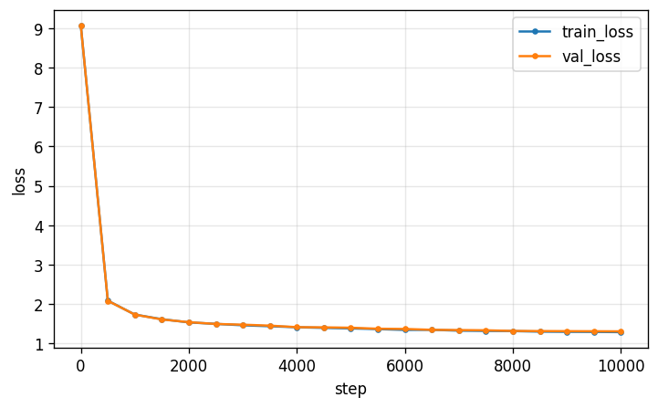

# pytorch-nanogpt
Pytorch implementation of a decoder-only GPT.

Trains a ~14M-parameter small language model end-to-end on the [TinyStories](https://huggingface.co/datasets/roneneldan/TinyStories) dataset,then explores the full modern post-training stack on [TinyStories Instruct](https://huggingface.co/datasets/roneneldan/TinyStoriesInstruct) with SFT (supervised fine-tuning) → DPO (direct policy optimization) → GRPO (group relative policy optimization) / PPO (proximal policy optimization).

## Results

After post-training, we evalute all the trained models with the SFT model as the baseline. For this we use 4 metrics:

1. **pass-rate** - the verifiable reward we chose. It's the fraction of words which the model is instructed to use in story generation that it actually uses.
2. **distinct-2** - distinct 2-grams / total 2-grams, a diversity proxy that catches repetitive, looping prose and tries to prevent reward hacking.
3. **win-rate** - the fraction of held-out prompts on which the stage's mean reward (over k=4 completions) beats SFT's.
4. **KL/tok** - per-token KL (Kullback–Leibler) divergence from the frozen SFT reference. It measures how far post-training has pulled the model from its starting distribution. A large KL is a diagnostic of over-optimization.

| stage | pass-rate | distinct-2 | win-rate vs SFT | KL/tok |
|---|---|---|---|---|
| Base | 0.177 | **0.971** | 0.000 (≥ SFT on 0.004) | 1.822 |
| SFT | 0.826 | 0.905 | — (baseline) | — |
| **DPO** | **0.967** | **0.930** | **0.736** (≥ SFT on 0.970) | 0.028 |
| GRPO | 0.950 | 0.920 | 0.694 (≥ SFT on 0.948) | 0.011 |
| PPO | 0.867 | 0.907 | 0.492 (≥ SFT on 0.754) | 0.002 |

For winrate, `≥ SFT` means that the model did at least as well as the SFT baseline i.e. the winrate including ties.

---

The main finding is that SFT training on the base model gives most of the improvement in capability; improving pass-rate from 0.18 to 0.83. The further post-training we performed gives further lift on top of that, but isn't as important as our SFT basleine.
- The **base** model: It's the most diverse (distinct-2 0.971) because its been training solely on next token generation so it ignores the task itself. We only optimize from here so a high diversity is exactly what we want.
- **SFT**: The most important functionality step and our baseline for post-training.
- **DPO**: Gave the best results with the highest pass-rate (0.967) and diversity (0.930), at a tiny KL (0.028). It's also the cheapest and simplest method.
- **GRPO**: A close second which achives numbers near that of DPO for about a third of the KL (0.011).
- **PPO**: The heaviest method which performed much worse than the simpler methods (≥ SFT on 0.754) and with very little movement (KL 0.002).


Even though eyeballing some sentences we might choose to prefer some GRPO results over DPO, on other examples the opposite is also true and the metrics do a decent job of gauging the overall result quality. 

<details>
<summary><b>Words: escape, war, tall</b> - we need the SFT to follow the task itself.</summary>

> **Base** (r=0.00): army, army, army, army, army, army, army, army, army, army, army, army, army, army, army... *(collapses into a single repeated token)*
> **SFT** (r=1.00): Tom and Lily were playing in the forest. They saw a big, tall tree house... "It's a war!" Tom said. "We need to escape!" ...They were safe. They said "Thank you, Ben. You are a good friend."
> **DPO** (r=1.00): Once upon a time, there was a tall man named Tom... He went to the window and saw a big war... Lily said, "I want to escape from the scary house and find a place to live." ...They all lived together and had fun in the forest.
> **GRPO** (r=1.00): Once upon a time, there was a tall man named Tom... Tom saw a big war with many people. They were all scared and wanted to escape... They met a nice man named Ben... They stayed with Ben and had a fun day.
> **PPO** (r=1.00): Tom and Lily are friends... "We can escape from the house." ...It is very tall... "I am Ben. He is a war. He is a big war. He is mean. He is mean. He is mean..." *(pass-rate hit, but the tail loops)*

</details>

<details>
<summary><b>Words: meet, waffle, new</b> — DPO and GRPO make more sense contextually.</summary>

> **Base** (r=0.33): Words, new friends. *(ignores the task)*
> **SFT** (r=0.67): Once upon a time, there was a little girl named Lily. She got a new waffle for breakfast... She saw a new friend named Timmy... "Yes, I met a new friend named Timmy."
> **DPO** (r=1.00): ...She had a new waffle for breakfast... Lily decided to go outside and meet her new friend, Timmy... "Hi Timmy, do you want to meet me?" ...happy that she had met her new friend.
> **GRPO** (r=1.00): ...She had a new waffle for breakfast... She saw a new friend in the park. Her new friend was a little boy named Max... Lily was happy to meet Max and they became good friends.
> **PPO** (r=1.00): ...She loved waffles more than anything in the world... While playing, she saw a new friend. It was a big, fluffy dog... Lily was so happy to meet the new friend.
</details>

<br>


Finally, the main takeaways from this implementation exercise are:
- Reward hacking will generally find the gaps in any verifiable reward. A classic measurement type problem where we need to be consider is what we're measuring is actually representable of the outcome we want.
- Similarly, for text-based problems it's important to consider multiple independent metrics. Pure validation loss on DPO training improved when training more than 1 epoch, but the validation perpexity increased from 2.9% to 42%. KL divergence alone didn't catch this.

## Getting Started

1. For GPU, go to the [pytorch](https://pytorch.org/get-started/locally/) website and select the local installs to get the bash command.

2. To use this repo, [install uv](https://docs.astral.sh/uv/getting-started/installation/). We use the [pytorch index](https://docs.astral.sh/uv/guides/integration/pytorch/#using-a-pytorch-index) for CUDA 12.6 [in this project](pyproject.toml).

3. Now install dependencies.

```bash
uv sync
```

4. The pipeline is driven from [src/main.py](src/main.py) which import each of the main functions which can also be run directly thanks to [hatchling](pyproject.toml). We can uncomment one stage at a time and run it as a module. 

```bash
uv run python -m src.main
```

5. The config [src/config.py](src/config.py) determines most of the runtime options. It's important to determine `context_length` and `vocab_size` early as its best for it to be fixed end-to-end.

6. Each training run saves the best checkpoint (by validation loss) under `checkpoints/<stage>/<timestamp>/` and SFT checkpoints are required to run DPO/GRPO/PPO.

7. The implementation for speculative-decoding is checked with [tests](tests/speculative_test.py).

```bash
uv run pytest
```

# Development

We split the development into 2 main parts - pretraining and post-training. 

1. Pretraining implements a decoder-only GPT as its continuation vs sequence-to-sequence generation.
2. We then explore the post-training stack
(SFT → DPO → GRPO/PPO).

---

## Part I - Pretraining

### 1. Data download
 First we download the [TinyStories](https://huggingface.co/datasets/roneneldan/TinyStories) dataset using [data.py](src/data/data.py).  This outputs `TinyStoriesV2-GPT4-train.txt` and `TinyStoriesV2-GPT4-valid.txt` with `<|endoftext|>` separators and automatic downloading/cache handling.

 We follow much of Karpathy's [minGPT/nanoGPT](https://github.com/karpathy/mingpt) here.

### 2. Tokenizer
Next we train a SentencePiece BPE (byte pair encoding) [tokenizer](src/models/tokenizer.py) on the raw train text. We choose a vocab size of 8000 and `<|endoftext|doubles as both BOS and EOS tokens.

We made the decision to increase `max_sentence_length` to 8192 so that all full stories are used, and sample 2M stories from the full 14.6M. Since the corpus is small and repetitive, this is both sufficient and more efficient to train the model, outputting `spm.model` and `spm.vocab`
 
### 3. Preprocess / pack 

Now we tokenize all the stories once and save the result. Then, by writing a [flat uint16 memmap](src/data/pack.py) (memory-mapped file) for both the train and validation splits (8k vocab fits in uint16), we can sample random slices at train time while the data stays on disk - keeping memory use low.

While we have the whole corpus tokenized, we also measure the per-story token-length distribution to determine the context length.

| split | tokens | stories | file |
|---|---|---|---|
| train | 530,386,257 | 2,717,700 | `data/packed/train.bin` |
| valid | 5,355,994 | 27,631 | `data/packed/val.bin` |

The median story is about 173 tokens and 89.3% of stories fit fully in 256 tokens which makes it a good choice for context length

| p50 | p90 | p95 | p99 | max | mean |
|---|---|---|---|---|---|
| 173 | 263 | 364 | 560 | 1646 | 194.2 |

### 4. Model

We build a decoder-only [GPT](src/models/gpt.py). Every block uses masked (causal) self-attention, where the query (Q), keys (K) and values (V) all come from the token stream and the mask stops each position from attending to future tokens.

The architecture is:
- Token embedding + learned absolute positional embedding, summed, then dropout
- **N = 6** pre-norm [blocks](src/models/block.py), each performing `x = x + attn(ln(x))` then `x = x + mlp(ln(x))`
- A final LayerNorm normalizing the residual stream before the head
- An LM head, `Linear(d_model → vocab)` with no bias, weight-tied to the token embedding (the same weights, shared)

### 5. Training loop

The loop ([pretrain.py](src/training/pretrain.py)) draws random fixed-length windows straight off the `uint16` memmap which makes the loop **stateless** and comes with some advantages:

1. Resuming the run is simple - just continue sampling. This stateless loading was also reuseable in post-training.
2. The same token can be seen at different positions which increases diversity.

The downside is that random sampling means that we may never see certain tokens, but this is fine here because the corpus is large compared to the model and the problem is simple story generation.

For optimization we use the standard GPT-2 recipe: 
- **AdamW** with betas 0.9/0.95 and weight decay 0.1
- **cosine learning-rate** decay with linear warmup
- **gradient clipping** at 1.0 to cap the size of any single update and prevent destabilization from a bad batch

We reach a large effective batch through **gradient accumulation** where we run several smaller microbatches, sum their gradients, and step the optimizer with the accumulated gradient. One pass on the 530M token corpus is ~4k steps (`batch 64 × accum 8 × context 256 = **131,072 tokens`)so a `max_steps` of 10k gives us about 2.5 epochs of training. We checkpoint every 500 steps.

<p align="left">
      
</p>

Thanks fo the size of the dataset compared to the size of the model, the train and validation track each other closely without overfitting. Validation loss flattens quickly.

### 6. Sampling

[Generation](src/inference/generate.py) is autoregressive - feed in the prompt, predict a distribution over the next token, sample one, append it, and repeat. We crop to the last `context_length` tokens each step and trim the output at the first EOS.

One learning here was that sampling performed better than beam search or greedy generation. For open-ended story generation a higher diversity is better, and we can shape the distribution before drawing from it by adjusting `temperature` to scale the logits (lower is greedier and safer, higher is more diverse), and `top-k` to keep only the k most likely tokens. At temperature 0 this collapses to greedy decoding. 

### 7. Evaluation

The main metric we used for evaluation at this stage is [validation perplexity](src/eval/perplexity.py) - the `exp(mean cross-entropy)` which is the average per-token branching factor (how many tokens the model is effectively "choosing between"). A lower value is better here because it means that the model assigned a high probablility to the token which actually came next. 

We evaluate on evenly-spaced windows across the whole split to keep the number deterministic and comparable run-to-run. The batches are capped at `max_batches` to keep evaluation cheap compared to the (~100× larger) train split.

We deliberately left a larger LLM judge scoring grammar/consistency/creativity/the overall story out of scope here due to cost and the theoretical case that one doesn't exist yet.

lower is better. Rather than a random sample, we score **evenly-spaced non-overlapping windows across the whole split** so the number is deterministic and representative run-to-run, with a `max_batches` cap that keeps evaluation cheap on the ~100× larger train split, and we token-weight the mean so partial final batches don't skew it.


---

## Part II - Post-training

Ordered offline/simple → online/hard, each stage independently useful.

**Acronym map (read once):** RLHF is not a separate method — it's the umbrella
for SFT → reward model → PPO. DPO and PPO/GRPO are alternative routes from the
*same* preference data (offline-and-simple vs online-and-stronger). GRPO is
just PPO minus the critic. Learning-optimal path:
**SFT → DPO → GRPO(verifiable)**, adding the reward model + PPO last only for
the full classic stack.

### 8. SFT (instruction format) ✓
Teach the base model a lightweight instruction schema. Use
`TinyStories-Instruct` — stories prefaced with constraints (required words,
summary, feature flags: dialogue / bad ending / moral / plot twist).
Fine-tune the base checkpoint on `(instruction → story)` pairs; same
next-token loss, masked to the response span.

Does two jobs: a prompt-following model, **and** the reference policy every
later RL/DPO stage regularizes against. Deliverable: `sft.pt`.

### SFT — teaching the instruction schema
- Goal: base LM → follows TinyStories-Instruct format (Summary/Words/
  Sentence/Features → Story). Does double duty: the deliverable model AND
  the frozen reference every later stage's KL is measured against.
- Method: same next-token loss as pretraining, but mask the prompt
  (labels = -1 up to "Story:") so only the response + EOS trains. Padded
  DataLoader over the finite instruct set; init from pretrained best.pt.
- Data: filter examples > context (drop, never truncate — model only sees
  complete stories). prompt = text incl. "Story:", response = story + EOS.
- Training: 1 epoch (~50k steps), LR 3e-4 (< pretraining 6e-4), cosine +
  warmup, early-stop on masked val loss (best 1.176).
- Results — the payoff is in the eval, not the loss number:
    · word-inclusion pass-rate: Base 0.08 → SFT 0.85  (SFT is what makes
      instruction-following possible at all)
    · LM trade-off: plain-story ppl 3.67 → 8.84 (specializing costs some
      general LM quality — a real, quantified cost, not a footnote)
    · before/after samples: base ignores "Words:", SFT includes them
- Key insight: the Base→SFT jump is the single biggest capability gain in
  the whole post-training stack; DPO/GRPO/PPO are refinements on top.


### 9. Reward / preference design ✓
The pivot everything downstream depends on. Three sources, cheapest first:
- **Verifiable / programmatic** — did the story contain the required words?
  match the summary length? include the feature? Zero models, zero labels.
  Cleanest fit for GRPO; the recommended starting point.
- **LLM-as-judge (RLAIF)** — score the rubric with a bigger model. Noisier,
  slower, captures quality the checks can't. Skip this to save costs - have done
  a lot of LLM judge work in evals.
- **Trained reward model** — only for the classic PPO/RLHF path (step 11).

Remove the incentive to repeat (set) and other reward hackable methods.

### 10. DPO
Do this **before** any online RL. Needs preference pairs `(chosen, rejected)`:
generate two completions per prompt, rank by verifiable score or judge.
No reward model, no sampling loop, no critic — a classification-style loss
against the frozen SFT reference, KL baked into the objective. Most stable,
easiest to debug. Deliverable: `dpo.pt`.

**Preference pairs** (`make_preferences.py`, finishes step 9): load the SFT
checkpoint and, for each instruct prompt with a `Words:` field, sample K
completions at temperature > 0, score each with `verifiable_reward`, and emit
`(prompt, chosen, rejected)` on a reward spread (ties skipped — no signal).
Saved to `data/dpo/pairs.jsonl`.

**Training** (`dpo_train.py`): policy init from SFT, a frozen reference clone of
SFT, a `sequence_logprob` helper (summed response-token log-probs, reusing the
SFT prompt masking), the `-log σ(β·[...])` objective, and checkpoints to
`dpo_checkpoints/`. Reuses the optimizer / scheduler / checkpoint machinery.
Diagnostics: reward accuracy (policy prefers chosen) and the reward margin.

Make sure we can view the output sentences (like in generate_story.py) and the overall eval of it.

Need to reduce gameability, and include a verifiable reward metric for fluency.


The objective is
    L = -log sigmoid( beta * [ (logp_pi(y_w) - logp_ref(y_w))
                             - (logp_pi(y_l) - logp_ref(y_l)) ] )
where ``logp(y)`` is the summed log-prob of the response tokens (``sequence_logprob``),


### 11. Reward model *(only for the RLHF/PPO path)*
A scalar reward head on the preference pairs via the Bradley-Terry loss.
**Skip entirely** for verifiable-reward GRPO or DPO — both bypass it. Build
only if you want the classic three-stage RLHF stack.

Is this the reward model for RLHF + PPO e.g. an LLM judge which outputs a score?

### 12. PPO / GRPO
Online RL — the hardest stage.

We can't RL our way to behaviours the policy has zero proablity of producing.
It only sharpens the existing distribution (which is why we SFT first - in this case on instruct).

- **PPO** — classic RLHF workhorse but heavy: policy + value/critic + reward
  model + frozen reference all resident, and finicky to stabilize.
- **GRPO** — drops the value network; samples a *group* of completions per
  prompt and normalizes each reward against the group mean/std for the
  advantage. Lighter (no critic), pairs perfectly with verifiable rewards.

Apply a KL penalty on the objective, and GAE for the advantage. 

Advantages come from GAE over the valuebaseline, then are normalized across the batch's response tokens.
    The reward model produces one scalar for the whole response and applies 
    that scalar to the very last response token, whilst the KL penalty applies 
    to every generated token.GAE reshapes how we estimate the advantage, normalized over the response tokens.

**Recommended:** GRPO with verifiable rewards. Treat PPO as optional "build the
full classic stack for the education."

GRPO vs PPO, side by side
              GRPO	                    PPO
baseline	    group mean/std	          learned critic (value head)
extra model	  none	                    critic backbone (trained)
advantage	    (r−mean)/std	            GAE over value fn
loss	        clipped surrogate + KL	  clipped actor + clipped value
Both consume the same shaped reward and frozen SFT reference, so you can grade them head-to-head.

That reframes your repetition question usefully: the base sets the diversity ceiling (0.92), and the real target for DPO/GRPO/PPO is getting distinct2 back up toward it while keeping pass-rate high. 

Instruction following decreases the diversity from free-flow story genereation.

PPO
Everything GRPO drops, added back. Each step:

1. **Rollout.** Sample prompts, one completion each from the policy; record the
   old per-token log-probs, the reference log-probs, and the critic's per-token
   values.
2. **Reward.** A per-token KL penalty `-beta*(logp_policy - logp_ref)` at every
   response token, plus the scalar shaped reward added at the final (EOS) token --
   the standard RLHF token-reward shaping.
3. **GAE.** Generalized Advantage Estimation over the response tokens using the
   critic's value baseline (this is what GRPO replaces with a group mean).
4. **Update.** `inner_epochs` passes of a clipped actor surrogate + a clipped
   value loss, actor and critic on separate optimizers/LRs.


GRPO
1. **Rollout.** Sample a batch of instruct prompts; for each, sample a *group* of
   `G` completions from the current policy.
2. **Reward.** Score every completion with the shaped reward (verifiable word
   inclusion minus a repetition penalty -- `src.eval.reward.shaped_reward`).
3. **Advantage.** Normalize each reward against its group: `A = (r - mean) / std`.
   No value network -- the group mean is the baseline. A group whose completions
   all score the same has zero advantage and contributes no gradient.
4. **Update.** A clipped PPO surrogate on the response tokens, with a per-token
   KL leash to the frozen reference (the SFT model), so the policy improves reward
   without drifting into the reward-hacking degeneracy step 13 catches.


### 13. Post-training eval
Three things, not one number:
- **Win-rate** vs the SFT baseline (verifiable pass-rate or judge preference)
- **KL from the reference** — catch over-optimization
- **Regression check** — base capability (perplexity, grammar) didn't collapse
- **Spot checks** - eyeball outputs from Base, SFT, DPO, PPO, GRPO
- **Speculative Decoding** - implement and try, its how all the labs are speeding up token throughput today 

Watch for **reward hacking**: an "include these words" reward will teach the
model to cram words in ungrammatically — pass-rate climbs while stories get
worse. Exactly why a quality metric rides alongside the reward.

---

## Resources

- Radford et al., [*Improving Language Understanding by Generative Pre-Training*](https://cdn.openai.com/research-covers/language-unsupervised/language_understanding_paper.pdf) (GPT, 2018)
- Eldan & Li, [*TinyStories: How Small Can Language Models Be and Still Speak Coherent English?*](https://arxiv.org/abs/2305.07759) (2023)
- Rafailov et al., [*Direct Preference Optimization*](https://arxiv.org/abs/2305.18290) (DPO, 2023)
- Shao et al., [*DeepSeekMath*](https://arxiv.org/abs/2402.03300) (GRPO, 2024)
- Schulman et al., [*Proximal Policy Optimization Algorithms*](https://arxiv.org/abs/1707.06347) (PPO, 2017)
- Leviathan et al., [*Fast Inference from Transformers via Speculative Decoding*](https://arxiv.org/abs/2211.17192) (2023)
- Karpathy, [minGPT](https://github.com/karpathy/minGPT) for the stateless-sampling training pattern
- [SentencePiece](https://github.com/google/sentencepiece) for subword tokenisation
